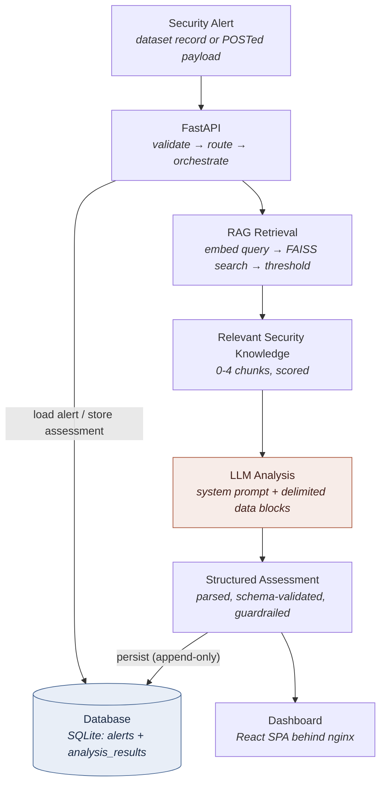

# AI-Powered Security Alert Analyst

A retrieval-augmented (RAG) triage assistant for SOC security alerts. Given a
raw alert it retrieves relevant internal security knowledge and returns a
structured, cited assessment — classification, risk score, confidence,
reasoning, evidence and a recommended next step — for a **human analyst to
review**.

The assessment is advisory. The model is offered no tools, the codebase has no
command-execution path, and the API exposes no endpoint that could isolate a
host, block an address, disable an account or delete a file. All three are
asserted by tests.

```bash
docker compose up --build     # → http://localhost:8080
```

**522 automated tests** · **no test calls a real LLM API**

| Document | Contents |
| --- | --- |
| [docs/technical-design.md](docs/technical-design.md) | Design decisions and rationale, end to end |
| [docs/architecture.md](docs/architecture.md) | Diagrams, data flow, trust boundaries |
| [docs/api.md](docs/api.md) | Endpoint reference with real request/response/error examples |
| [docs/rag.md](docs/rag.md) | Corpus, chunking, embeddings, retrieval, failure states |
| [docs/security.md](docs/security.md) | Threat model, controls, residual risks |
| [docs/demo-script.md](docs/demo-script.md) | 10-minute walkthrough with expected output |
| [docs/analysis.md](docs/analysis.md) · [docs/persistence.md](docs/persistence.md) · [docs/reliability.md](docs/reliability.md) · [docs/frontend.md](docs/frontend.md) | Component deep-dives |

---

## Contents

[1. Project overview](#1-project-overview) · [2. Problem statement](#2-problem-statement) ·
[3. Architecture](#3-architecture) · [4. Features](#4-features) ·
[5. Technology stack](#5-technology-stack) · [6. Project structure](#6-project-structure) ·
[7. Environment variables](#7-environment-variables) · [8. Setup](#8-setup) ·
[9. Docker usage](#9-docker-usage) · [10. Local development](#10-local-development) ·
[11. Running tests](#11-running-tests) · [12. API examples](#12-api-examples) ·
[13. RAG explanation](#13-rag-explanation) · [14. Security considerations](#14-security-considerations) ·
[15. Known limitations](#15-known-limitations) · [16. Future improvements](#16-future-improvements)

---

## 1. Project overview

The system takes one security alert, finds the parts of an internal security
knowledge base that bear on it, and asks a language model for a structured
triage assessment. The result is validated, guardrailed server-side, stored, and
shown in a dashboard that an analyst uses to decide what to do.

What it produces for each alert:

| Output | Meaning |
| --- | --- |
| `classification` | `Benign`, `Suspicious` or `Malicious` |
| `risk_score` | 0–100 — potential harm if the activity is what it appears to be |
| `confidence_score` | 0–100 — how well the evidence supports the verdict. A separate question from risk |
| `reasoning` | The explanation, including uncertainty and contradictions |
| `recommended_action` | Advisory investigation steps for a human |
| `evidence` | Concrete observations from the alert or the retrieved knowledge |
| `retrieved_knowledge` | The knowledge chunks actually relied on, verified against retrieval |
| `human_review_required` | Computed server-side. The model cannot set it |

Three principles run through the implementation:

- **Never fabricate.** If the model call fails, the response is an error
  envelope with no `assessment` key at all and nothing is persisted. If
  retrieval fails, the assessment still happens but says plainly that it had no
  evidence behind it, and its confidence is capped.
- **The model is contained, not trusted.** Alert text is data, never
  instructions. Model output is parsed as hostile input. Citations are checked
  against what was actually retrieved.
- **A human decides.** Every assessment carries an advisory notice, and
  recommendations that read as automated containment get a mandatory
  human-verification gate.

## 2. Problem statement

A SOC analyst works a queue of hundreds of alerts per shift. Most are noise, a
few matter, and the difference usually is not visible in the alert itself.

Consider `powershell.exe -NoProfile -ExecutionPolicy Bypass -File C:\Scripts\Export-ADUsers.ps1`.
Every indicator a generic detection rule looks for is present. Whether it is
routine depends on knowledge the alert does not carry: that this host runs a
signed reporting script on that schedule, that the account is expected, that the
path is approved.

That knowledge lives in runbooks, baseline documents and analysts' heads. The
consequences are familiar: slow triage, inconsistent verdicts between analysts,
and alert fatigue that eventually misses something real.

A general-purpose LLM does not fix this. It knows what `-EncodedCommand` means
but nothing about *your* estate, and asked to triage alerts it will produce
confident, unfalsifiable prose — which in a security context is worse than no
answer, because it is actionable-looking and wrong.

**The approach here:** retrieve the organisation's own security knowledge for
each alert, give the model only that plus the alert, require a schema-bounded
answer with citations, and validate everything it returns before an analyst sees
it. The knowledge base is editable markdown — a corpus change takes effect in
about 30 milliseconds, with no retraining.

## 3. Architecture



The shaded step is the only one that leaves the trust boundary.

**Two containers, and that is the whole system.** There is no database server
and no vector database: storage is SQLite in a named volume, and retrieval is a
FAISS index held in the backend process, rebuilt from `data/knowledge/` at
startup (8 documents → 24 chunks, ~30 ms). At this scale a separate service for
either would add a container, a startup dependency and a failure mode while
changing nothing a user can observe.

```
                ┌──────────────────────────────────────────────┐
 browser ─:8080→│ frontend — nginx, uid 101                    │
                │   serves the React bundle                    │
                │   /api/*  ──────────────┐  single origin,    │
                └─────────────────────────┼──────no CORS───────┘
                                          ↓ internal network
                ┌─────────────────────────────────────────────┐
 curl ────:8000→│ backend — uvicorn + FastAPI, uid 10001      │
                │   FAISS index, in-process                   │
                │   SQLAlchemy ──► SQLite                     │
                └───┬──────────────┬──────────────────┬───────┘
                    ↓              ↓                  ┊
            ./data (ro bind)  analyst-db volume   LLM provider
            alerts+knowledge  /app/var/app.db     (HTTPS, only
                                                  with a key)
```

Full diagrams, the request sequence and the trust-boundary map:
**[docs/architecture.md](docs/architecture.md)**.

## 4. Features

**Triage**
- 45-alert dataset across seven categories, validated at seed time against the
  same schema that validates API input.
- Paginated queue with database-side search (alert id, host, user, process,
  command line, description) and filters on severity, category and latest AI
  classification.
- Each alert carries its latest verdict in the listing — one query, no N+1.

**Analysis**
- `POST /analyze-alert` by alert id, or by a complete payload for an alert that
  is not in the dataset.
- Provider-neutral LLM layer; `openai` covers OpenAI and any OpenAI-compatible
  endpoint (Azure proxies, vLLM, Ollama, LM Studio) via `LLM_BASE_URL`.
- Retry with exponential backoff, including a correction retry that tells the
  model what validation rejected.
- Server-side guardrails: citation verification, confidence capping,
  classification/risk consistency checks, destructive-recommendation gating, and
  a server-computed human-review flag.

**Knowledge**
- Eight markdown documents with YAML frontmatter, chunked with overlap and
  embedded into FAISS.
- Two embedding backends: a keyless offline hashing embedder (default) and
  OpenAI `text-embedding-3-small`.
- `POST /rag/reindex` picks up corpus edits without a restart.
- Three distinct retrieval states — `relevant`, `insufficient`, `failed` —
  preserved through the prompt, the API, the stored row and the UI.

**Dashboard**
- React 18 SPA: triage queue, filters, detail pane, assessment panel with
  evidence and cited knowledge.
- Loading, empty, error and degraded states are all explicit; a missing LLM key
  shows a banner and disables the analysis control rather than failing on click.
- Keyboard navigable, screen-reader labelled, audited with axe in CI-style e2e
  tests.

**Operations**
- `/health` (liveness) and `/health/ready` (per-dependency readiness with
  reasons).
- One request id in the `X-Request-ID` header, the error body and every log line
  for that request. `LOG_FORMAT=json` for aggregators.
- Append-only assessment history with full reproduction context: retrieval
  query, `top_k`, threshold, top score, retrieval status, embedding provider,
  model, prompt version, temperature.

## 5. Technology stack

| Layer | Choice | Version | Why |
| --- | --- | --- | --- |
| API | FastAPI + uvicorn | 0.141 / 0.40 | Pydantic validation at the boundary and OpenAPI for free |
| Language | Python | 3.12 | — |
| Validation | Pydantic + pydantic-settings | 2.11 / 2.12 | One schema validates the dataset, API input and model output |
| ORM | SQLAlchemy | 2.0 | Engine-agnostic, so SQLite → PostgreSQL is a URL change |
| Database | SQLite (WAL) | stdlib | Single-writer prototype; no server to run, back up or secure |
| Vectors | faiss-cpu | 1.15 | `IndexFlatIP` — exact search, no training, 24 vectors |
| Numerics | NumPy | 2.2 | — |
| LLM client | openai | 1.109 | Also speaks to any OpenAI-compatible endpoint |
| Frontend | React + Vite | 18.3 / 8.3 | No router or state library — the app does not need them |
| Web server | nginx unprivileged | 1.27 | Static bundle + `/api/` reverse proxy, non-root |
| Backend tests | pytest | 9.1 | 367 tests |
| Frontend tests | vitest + Testing Library + jsdom | 4.1 | 123 tests |
| E2E | Playwright + axe-core | 1.63 | 32 tests in a real browser |
| Lint / types | ruff, mypy | 0.16 / 1.11 | — |
| Runtime | Docker Compose | v2 | Two services, health checks, named volume |

## 6. Project structure

```
backend/
  app/
    api/            routes (health, alerts, analyze, rag), deps, error handlers
    core/           config (env vars), logging, secret redaction
    db/             engine + SQLite pragmas, migrations, declarative base
    llm/            provider protocol, factory, OpenAI implementation
    models/         ORM tables: alerts, analysis_results
    rag/            ingest → embeddings → store (FAISS) → service
    repositories/   every database query; routes never touch the ORM
    schemas/        Pydantic contracts — the validation boundary
    services/       pipeline, analysis engine + guardrails, prompts,
                    response_parser, sanitize
    seed.py         dataset import      main.py  app factory + lifespan
  tests/            367 tests: API, engine, providers, parser, RAG, db,
                    repositories, seed, security, reliability, integration
  requirements.txt · requirements-dev.txt · Dockerfile · pyproject.toml

frontend/
  src/
    api/            fetch client + endpoint functions
    hooks/          request lifecycle (queue, analysis, readiness)
    components/     table, filters, detail, analysis panel, badges, meters
    lib/            formatting helpers
    test/           vitest setup, fixtures, routing fetch stub
    **/*.test.jsx   123 component and unit tests, co-located
  e2e/              32 Playwright tests against a real stack + axe audit
  Dockerfile · nginx.conf · vite.config.js

data/
  alerts/           alerts.json (45 alerts), eval_labels.json, build_alerts.py
  knowledge/        8 security knowledge documents (the RAG corpus)

docs/               architecture, technical-design, api, rag, security,
                    demo-script, analysis, persistence, reliability, frontend
docker-compose.yml · .env.example · .gitignore · README.md
```

## 7. Environment variables

Everything is read at run time from `.env`, which is **optional** — without it
the stack still builds, starts and serves the dashboard, alerts, stored
assessments and the knowledge index. Only `/analyze-alert` needs a key, and it
says so rather than failing obscurely. `.env` is gitignored and never copied
into an image. Full annotated list: [`.env.example`](.env.example).

**Application**

| Variable | Default | Purpose |
| --- | --- | --- |
| `ENVIRONMENT` | `development` | `production` disables `/docs`, `/redoc`, `/openapi.json` |
| `ENABLE_API_DOCS` | unset | Explicit override for the above |
| `LOG_LEVEL` | `INFO` | — |
| `LOG_FORMAT` | `text` | `json` for line-delimited logs |
| `CORS_ORIGINS` | `http://localhost:5173,http://localhost` | Comma-separated. Not used in the Docker path, which is same-origin |

**LLM** (required only for analysis)

| Variable | Default | Purpose |
| --- | --- | --- |
| `LLM_API_KEY` | *(empty)* | Enables `/analyze-alert`. Falls back to `OPENAI_API_KEY` |
| `LLM_PROVIDER` | `openai` | Also covers any OpenAI-compatible server |
| `LLM_MODEL` | `gpt-4o-mini` | Falls back to `OPENAI_MODEL` |
| `LLM_BASE_URL` | unset | e.g. `http://localhost:11434/v1` for Ollama |
| `LLM_TEMPERATURE` | `0.1` | Triage should be near-deterministic |
| `LLM_TIMEOUT_SECONDS` | `30` | Per attempt |
| `LLM_MAX_RETRIES` | `2` | Retries after the first attempt (0–5) |
| `LLM_RETRY_BACKOFF_SECONDS` | `1.0` | Exponential, capped at 10 s |
| `LLM_MAX_OUTPUT_TOKENS` | `1200` | — |

**RAG**

| Variable | Default | Purpose |
| --- | --- | --- |
| `EMBEDDING_PROVIDER` | `local` | `local` is keyless and offline; `openai` is semantic |
| `EMBEDDING_MODEL` | `text-embedding-3-small` | Used when the provider is `openai` |
| `RAG_CHUNK_SIZE` / `RAG_CHUNK_OVERLAP` | `800` / `150` | Characters |
| `RAG_TOP_K` | `4` | Chunks retrieved per query |
| `RAG_SIMILARITY_THRESHOLD` | `0.08` | Minimum cosine to count as relevant. Tuned to the hashing embedder |
| `RAG_FAILURE_MODE` | `degrade` | `degrade` answers without evidence and marks it; `fail` returns 503 |
| `RAG_WARM_ON_STARTUP` | `true` | Build the index at boot rather than on first request |

**Security and storage**

| Variable | Default | Purpose |
| --- | --- | --- |
| `LLM_REDACT_TELEMETRY` | `true` | Redact credential-shaped values before sending telemetry to the provider |
| `MAX_REQUEST_BYTES` | `256000` | Request body cap |
| `DATABASE_URL` | `sqlite:///./app.db` | Overridden by Compose to `sqlite:////app/var/app.db` |
| `DATA_DIR` | repo `data/` | Overridden by Compose to `/app/data` |
| `AUTO_SEED` | `true` | Import the dataset at startup when the table is empty |

`DATA_DIR` and `DATABASE_URL` are set in `docker-compose.yml`, which takes
precedence over `.env`: they are container paths, not preferences.

**Host ports** (Compose only, not application settings)

| Variable | Default |
| --- | --- |
| `BACKEND_PORT` / `FRONTEND_PORT` | `8000` / `8080` |

## 8. Setup

Requires **Docker** only. No local Python, Node or database.

```bash
git clone https://github.com/sooovamm/Security-Alert-Analyst.git
cd Security-Alert-Analyst
cp .env.example .env          # optional — edit LLM_API_KEY to enable analysis
docker compose up --build
```

Then open **<http://localhost:8080>**. The API is on
<http://localhost:8000> (Swagger UI at `/docs`).

First start applies migrations, seeds the 45-alert dataset and builds the
knowledge index, so the dashboard shows real data with no manual step.

Verify:

```bash
curl http://localhost:8000/health          # {"status":"ok",...}
curl http://localhost:8000/health/ready    # per-dependency readiness
```

If 8000 or 8080 is taken:

```bash
BACKEND_PORT=18000 FRONTEND_PORT=18080 docker compose up --build
```

## 9. Docker usage

```bash
# build
docker compose build                 # both images
docker compose build --no-cache      # ignore the layer cache

# run
docker compose up --build            # foreground, streaming logs
docker compose up -d --build         # detached
docker compose ps                    # health status per service
docker compose logs -f backend       # follow one service

# stop
docker compose down                  # keeps the database volume
docker compose down -v               # also wipes stored assessments
docker compose restart backend
```

The frontend waits for the backend to report *healthy* before starting, so the
dashboard never loads against an API that is still seeding.

**Container hardening.** Both images run as a non-root user with
`no-new-privileges`. The backend's code directory is root-owned so the process
cannot rewrite its own source; `/app/var` is the only writable path and `data/`
is mounted read-only. No secret is present in either image: `.env` is excluded
by `.dockerignore` and every credential arrives as an environment variable at
run time.

## 10. Local development

Only needed to work on the code — running the app needs Docker alone.

**Backend**

```bash
cd backend
python -m venv .venv && source .venv/bin/activate
pip install -r requirements-dev.txt
uvicorn app.main:app --reload          # http://localhost:8000
```

**Frontend** (separate terminal)

```bash
cd frontend
npm install
npm run dev                            # http://localhost:5173
```

The Vite dev server proxies `/api` to `http://localhost:8000`, mirroring what
nginx does in the container, so the React code always calls `/api/...` and CORS
never arises. Point it elsewhere with `VITE_BACKEND_URL`.

**Editing the knowledge base.** `data/` is bind-mounted into the container, so
edit a document and reindex — no restart, no rebuild:

```bash
curl -X POST http://localhost:8000/rag/reindex
# {"status":"ok","documents":8,"chunks":24,"duration_ms":26}
```

**Re-seeding** happens automatically when the `alerts` table is empty; wipe with
`docker compose down -v` for a clean database.

## 11. Running tests

**522 tests.** None calls a real LLM API — the provider is the only dependency
always mocked, because it costs money, needs a key and cannot be made
deterministic. FAISS, SQLite, the HTTP layer and a real browser all run for real
in at least one suite.

| Suite | What runs for real | What is mocked | Count |
| --- | --- | --- | --- |
| Backend — pytest | app, DB, guardrails, validation | LLM provider; RAG in unit tests | 367 |
| Frontend — vitest + jsdom | components, hooks, API client | `fetch` (no backend at all) | 123 |
| End-to-end — Playwright | real browser, real stack, real DB | nothing (LLM optional) | 32 |

**In Docker** (no local toolchain needed):

```bash
docker compose --profile test run --rm tests             # backend, 367
docker compose --profile test run --rm frontend-tests    # frontend, 123

docker compose --profile test run --rm tests pytest tests/test_rag.py
docker compose --profile test run --rm tests pytest -k injection
docker compose --profile test run --rm tests ruff check app tests
docker compose --profile test run --rm tests mypy app
```

Backend dependencies come from the image and the source is bind-mounted
read-only, so an edit is picked up without a rebuild. Frontend sources are baked
in — rebuild with `docker compose --profile test build frontend-tests` after
editing them.

**End-to-end**, against the running stack (needs Playwright locally):

```bash
docker compose up -d
cd frontend && npm install && npx playwright install --with-deps chromium
npm run test:e2e                       # desktop + mobile viewports
```

Without an LLM key, the tests needing a real assessment skip themselves —
24 pass, 8 skip. With one configured, all 32 run.

**Without Docker:**

```bash
cd backend && source .venv/bin/activate && pytest && ruff check app tests
cd ../frontend && npm test
```

Latest full run: `367 passed` · `123 passed` · `32 passed` · ruff clean ·
`mypy app` clean · `pip-audit` and `npm audit` report no known vulnerabilities.

## 12. API examples

Seven endpoints. Full reference with every field, example and error code:
**[docs/api.md](docs/api.md)**.

| Method | Path | Purpose |
| --- | --- | --- |
| GET | `/health` | Liveness |
| GET | `/health/ready` | Readiness, per dependency |
| GET | `/alerts` | List, search and filter |
| GET | `/alerts/{alert_id}` | One alert |
| GET | `/alerts/{alert_id}/analysis` | Latest stored assessment, no LLM call |
| POST | `/analyze-alert` | RAG + LLM analysis |
| POST | `/rag/reindex` | Rebuild the knowledge index |

**Readiness**

```bash
curl http://localhost:8000/health/ready
```

```json
{"status":"degraded","degraded_reasons":["no LLM API key configured: /analyze-alert is unavailable"],
 "llm_configured":false,"data_present":true,"database_ready":true,
 "alert_count":45,"rag_index_ready":true}
```

**Browse and filter**

```bash
curl "http://localhost:8000/alerts?limit=5"
curl "http://localhost:8000/alerts?severity=critical"
curl "http://localhost:8000/alerts?q=powershell"
curl "http://localhost:8000/alerts?classification=Malicious"
```

**Analyse an alert**

```bash
curl -X POST http://localhost:8000/analyze-alert \
  -H "Content-Type: application/json" \
  -d '{"alert_id":"ALRT-1002"}'
```

```json
{
  "alert": { "alert_id": "ALRT-1002", "severity": "high", "…": "…" },
  "assessment": {
    "classification": "Malicious",
    "risk_score": 91,
    "confidence_score": 86,
    "reasoning": "Base64-encoded, hidden-window PowerShell launched off-hours from a standard user workstation, decoding to a network download routine…",
    "recommended_action": "Escalate to incident response and isolate the host after analyst verification…",
    "evidence": ["-enc with -w hidden", "decoded payload performs a network download"],
    "human_review_required": true,
    "human_review_reasons": ["classified as Malicious", "high risk score (91)"],
    "validation_warnings": [],
    "advisory_notice": "Advisory output only. This assessment was generated by an AI model and must be reviewed by a human analyst…"
  },
  "retrieval": {
    "status": "relevant",
    "note": "4 relevant knowledge chunk(s) retrieved.",
    "documents": [{"chunk_id":"01-powershell-attacks#0","title":"PowerShell Security","score":0.3167,"excerpt":"…"}],
    "cited_chunk_ids": ["01-powershell-attacks#0"]
  },
  "meta": {"analysis_id":3,"provider":"openai","model":"gpt-4o-mini",
           "prompt_version":"analysis-v1","attempts":1,"latency_ms":2380,
           "persisted":true,"cached":false,"notes":[]}
}
```

**Analyse an alert that is not in the dataset** — send a complete payload. These
are not persisted.

```bash
curl -X POST http://localhost:8000/analyze-alert \
  -H "Content-Type: application/json" \
  -d '{"alert":{"alert_id":"ALRT-ADHOC-1","timestamp":"2025-09-20T03:14:00Z",
       "hostname":"WKSTN-OPS-01","username":"a.singh","source_ip":"10.20.5.9",
       "process":"rundll32.exe","command_line":"rundll32.exe javascript:\"..\\mshtml,RunHTMLApplication \"",
       "severity":"high","category":"Suspicious Command Execution",
       "description":"rundll32 invoked with a javascript: protocol handler."}}'
```

**Read a stored assessment** (no model call)

```bash
curl http://localhost:8000/alerts/ALRT-1002/analysis    # meta.cached = true
```

**Errors** — one envelope everywhere, with a stable `code` and a `request_id`
that matches the `X-Request-ID` header and the server logs:

```json
{"error":{"code":"alert_not_found",
          "message":"No alert with id 'ALRT-9999'. Send a complete alert payload to analyse an alert that is not in the dataset.",
          "request_id":"9226541ab7ec43be","details":null}}
```

| Code | Status | When |
| --- | --- | --- |
| `validation_error` | 422 | Body or parameters failed validation |
| `payload_too_large` | 413 | Over `MAX_REQUEST_BYTES` |
| `alert_not_found` / `analysis_not_found` | 404 | Unknown alert / never analysed |
| `llm_unavailable` | 503 | No API key, or credentials rejected |
| `llm_timeout` | 504 | Every attempt timed out |
| `llm_provider_error` / `invalid_model_response` | 502 | Provider failed / output never validated |
| `rag_unavailable` | 503 | Retrieval failed and `RAG_FAILURE_MODE=fail` |
| `database_unavailable` | 503 | Database read or write failed |

A failed analysis returns an error envelope with **no `assessment` key at all**,
and nothing is persisted.

## 13. RAG explanation

Full design: **[docs/rag.md](docs/rag.md)**.

**Why retrieval.** A general model knows what `-enc` means but not that your
finance workstations run a signed reporting script every morning. The knowledge
base supplies the local judgement, and citations let an analyst check the
reasoning against a document instead of trusting the model's memory. Editing a
markdown file changes behaviour in ~30 ms — no retraining.

**The pipeline**

```
data/knowledge/*.md
  │  parse YAML frontmatter (title, category, source), strip it, clean whitespace
  ▼
chunk: 800 chars, 150 overlap, snapped back to a word boundary
  │  → 24 chunks from 8 documents, ids like  01-powershell-attacks#0
  ▼
embed: HashingEmbedder (1024-d, keyless, offline) | OpenAI text-embedding-3-small (1536-d)
  │  L2-normalised, so inner product == cosine similarity
  ▼
FAISS IndexFlatIP — exact search, no training
  ▲
  │  query = category + process + command_line[:500] + description[:500]
  ▼
top_k = 4, drop anything below similarity 0.08
  ▼
context block, each chunk labelled with its id, title, category and score
```

**The corpus** is eight documents: PowerShell attacks, brute force and
credential access, malware indicators, C2 and network, privilege escalation,
LOLBins, **benign administrative baselines**, and a triage playbook. The benign
baselines document is deliberate — a corpus of only attack patterns biases every
retrieval toward "this looks malicious", because that is the only text available
to match.

**Three retrieval states, kept distinct:**

| Status | Meaning | Effect |
| --- | --- | --- |
| `relevant` | Chunks cleared the threshold | Normal grounded analysis |
| `insufficient` | Retrieval ran, nothing was relevant | Prompt says so; confidence capped at 60 |
| `failed` | Retrieval could not run at all | Prompt says so; confidence capped; flagged for review |

`insufficient` and `failed` both mean "no evidence", for opposite reasons — *we
looked and found nothing* versus *we could not look*. Collapsing them would let
a broken retriever pass for a quiet one, which is the failure most likely to go
unnoticed. The distinction survives into the API, the stored row and the UI.

**Anti-hallucination.** Every chunk id the model cites is checked against what
was actually retrieved; unknown ids are dropped with a warning, and citation
metadata comes from the retrieval record, not the model. A fabricated source
cannot reach the analyst.

## 14. Security considerations

Full threat model, controls and residual risks:
**[docs/security.md](docs/security.md)**.

The system takes attacker-controlled text, sends it to a third party, and turns
the reply into something an analyst may act on. Every one of those is a
boundary.

**Prompt injection.** Alert text is untrusted. Each prompt wraps it in blocks
tagged with a fresh random id (`<alert_data id="d99b84068fe5d350">`), so a
closing tag cannot be forged; delimiter-shaped text is rewritten to square
brackets before assembly; the alert is JSON-encoded; every field is length
capped. Verified end to end by capturing the outgoing prompt: the injected text
stayed inside the data block, a forged `</alert_data>` arrived as
`[/alert_data]`, the system prompt was byte-identical to a benign run, and the
attacker's requested verdict appeared nowhere.

**The model cannot act.** No `tools` or `functions` are offered in the provider
request; the codebase has no `subprocess`/`eval`/`exec` path; the API has no
endpoint that could isolate, block, disable or delete. All three are asserted by
tests. The worst a hijacked response achieves is being rejected.

**Telemetry leaving the estate.** Real command lines carry passwords, API keys
and connection strings. `LLM_REDACT_TELEMETRY` (on by default) redacts
credential-shaped values from `command_line`, `description` and `process` before
prompt construction, preserving surrounding structure so the behaviour is still
analysable, and tells the model what was redacted. It is regex-based: a risk
reduction, not a guarantee.

**Untrusted model output.** Size-capped, one code fence tolerated and nothing
else, duplicate JSON keys rejected, strict Pydantic validation with `StrictInt`
scores and `extra="forbid"`. Parse errors report field locations and types only,
never values.

**Guardrails after validation.** Citations verified against retrieval;
confidence capped at 60 without relevant knowledge; classification/risk
inconsistencies flagged; destructive recommendations without a human-verification
condition get a mandatory notice; alert text carrying instruction- or
delimiter-shaped content forces human review, because a model that obeyed an
injection looks exactly like one that did not; `human_review_required` computed
server-side from verdict, risk, confidence, retrieval state, warnings and that
input check — the model cannot set it.

**Secrets.** `SecretStr` so the key never appears in `repr()`; a redacting
filter on every log handler; `.env` gitignored and excluded from both images; no
credentials in the database.

**The gap:** there is **no authentication or authorisation**. Every endpoint is
open, including `POST /rag/reindex`, which mutates server state, and
`POST /analyze-alert`, which spends money. There is no rate limiting. This
belongs on a trusted network or a laptop, and nothing here should be read as
claiming otherwise.

## 15. Known limitations

- **No authentication, authorisation or rate limiting.** The largest gap between
  this prototype and something deployable.
- **No measured accuracy.** `data/alerts/eval_labels.json` holds expected
  classifications for all 45 alerts, but it is used only to assert the dataset
  is balanced — no scoring harness runs them against a live model. This
  repository states no accuracy figure anywhere.
- **The default embedder is lexical, not semantic.** Feature hashing matches
  wording, so an alert phrased unlike the corpus retrieves poorly.
  `EMBEDDING_PROVIDER=openai` addresses this and has not been measured here
  against a real key.
- **Retrieval parameters are unvalidated.** `top_k = 4` and `threshold = 0.08`
  rest on inspection, not a precision/recall curve.
- **Credential redaction is best-effort.** Regexes miss secrets that do not look
  like secrets — a fully lowercase password after `-p` is deliberately not
  matched, to avoid mangling ordinary command lines.
- **Prompt-injection resistance is defence in depth, not a proof.** The
  containment and the guardrails are tested; the model's own adherence to the
  system prompt is not guaranteed by this codebase.
- **Single process, single writer.** The FAISS index is per-process and SQLite
  is single-writer, so a second backend replica would have its own index and
  contend on writes.
- **No streaming, no batch analysis.** One alert per request, blocking.
- **No alert ingestion.** Alerts come from the seeded dataset or a request body;
  there is no SIEM connector, queue or webhook.
- **The dataset is synthetic.** 45 hand-built alerts across seven categories —
  realistic in shape, not drawn from a real SOC.
- **Eight knowledge documents is a demonstration corpus**, orders of magnitude
  smaller than real triage knowledge.

## 16. Future improvements

Roughly in order of value returned per unit of work:

1. **Authentication and per-endpoint authorisation**, with the two POST
   endpoints behind it, plus rate limiting.
2. **An evaluation harness** driving the 45 labelled alerts through a real
   model, reporting per-class precision/recall and score calibration — so prompt
   and retrieval changes can be judged rather than guessed at.
3. **Retrieval quality measurement**: a labelled query/chunk set, so `top_k` and
   the similarity threshold rest on numbers.
4. **Hybrid retrieval** (BM25 alongside vectors) with a reranking pass — lexical
   and semantic matching fail on different alerts.
5. **Batch analysis** with bounded concurrency, so a queue can be triaged in one
   operation.
6. **PostgreSQL and a persisted vector store** when the corpus or the deployment
   outgrows one process. Both are contained changes by design: the repository
   layer is engine-agnostic and the index sits behind a small interface.
7. **Analyst feedback capture** (agree / disagree / corrected verdict) stored
   alongside the assessment — the only honest route to measuring real-world
   accuracy, and the raw material for few-shot improvement.
8. **Structured log shipping and metrics.** `LOG_FORMAT=json` exists; there is
   no metrics endpoint or dashboard yet.
9. **A Content-Security-Policy and security headers** on the served SPA.
10. **Automated dependency scanning in CI.** `pip-audit` is pinned in
    `requirements-dev.txt` but nothing runs it on a schedule.

## License

[MIT](LICENSE)
