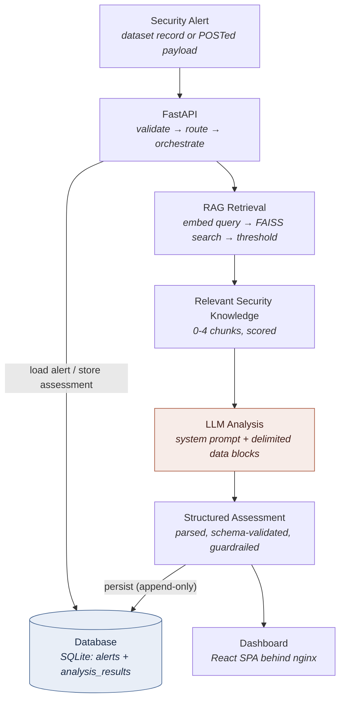
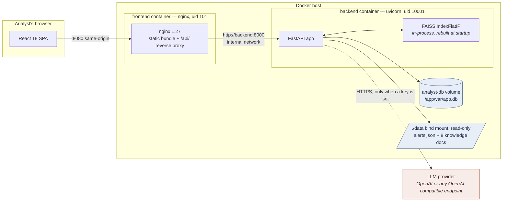
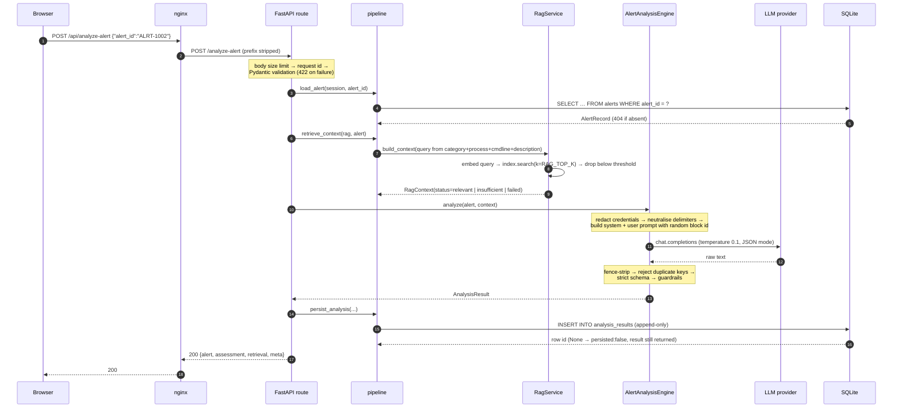
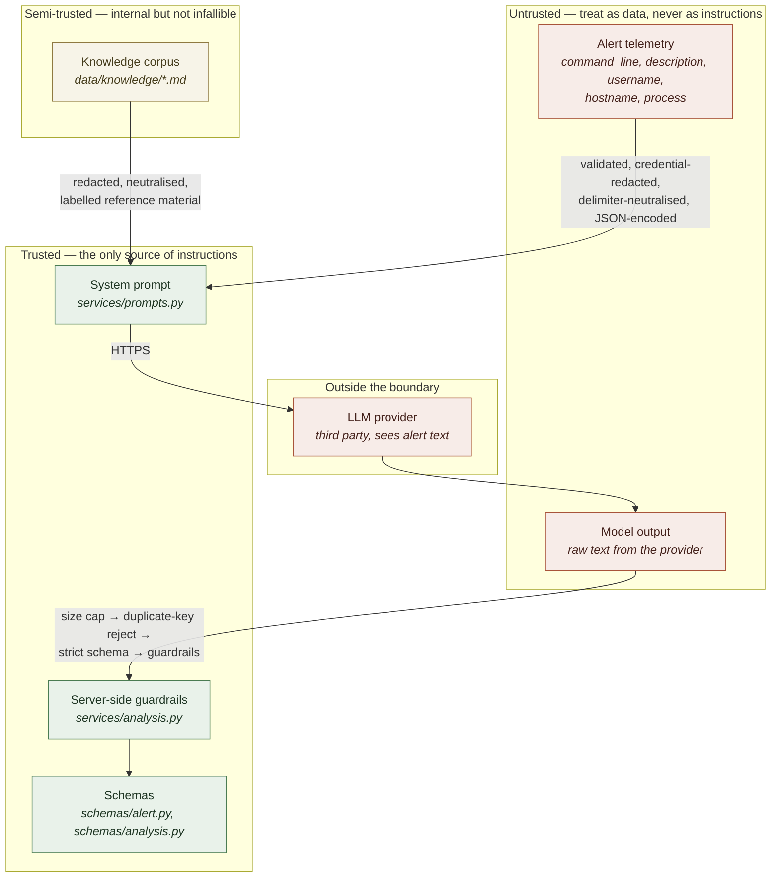

# Architecture

How a security alert becomes a reviewed assessment, which component owns each
step, and where the trust boundaries sit.

Companion documents: [technical-design.md](technical-design.md) for the design
rationale, [rag.md](rag.md) for retrieval, [security.md](security.md) for the
threat model, [api.md](api.md) for the HTTP contract.

---

## 1. The path an alert takes

The LLM box is shaded because it is the only step that leaves the trust
boundary — see §4.

## 2. Runtime components

Two containers. There is no database server and no vector database.

| Component | Implementation | Where |
| --- | --- | --- |
| Dashboard | React 18, Vite build, no router or state library | `frontend/src/` |
| Web server / proxy | nginx 1.27 unprivileged, listens on 8080 | `frontend/nginx.conf` |
| API | FastAPI + uvicorn, app-factory pattern | `backend/app/main.py` |
| Orchestration | load → retrieve → analyse → persist → present | `backend/app/services/pipeline.py` |
| Retrieval | FAISS `IndexFlatIP` over normalised vectors | `backend/app/rag/` |
| Analysis engine | prompt → provider → parse → validate → guardrails | `backend/app/services/analysis.py` |
| LLM abstraction | `LLMProvider` protocol; one implementation (`openai`) | `backend/app/llm/` |
| Storage | SQLAlchemy 2.0 ORM over SQLite (WAL) | `backend/app/db/`, `app/models/` |
| Queries | repository classes, no ORM access from routes | `backend/app/repositories/` |

**The RAG index is not a service.** It is a FAISS flat index held in the
backend process, rebuilt from `data/knowledge/` at startup — 8 documents to 24
chunks in roughly 30 ms. Nothing is written to disk, so there is no index file
to invalidate, and `POST /rag/reindex` rebuilds it in place after a corpus edit.

## 3. Data flow: `POST /analyze-alert`

Steps that can fail without failing the request:

- **Retrieval breaks** → `RagContext.failed_context()`; the assessment is
  produced from the alert alone, flagged `retrieval.status = "failed"`, and
  confidence is capped at 60. Set `RAG_FAILURE_MODE=fail` to return 503 instead.
- **The database write fails** → the assessment is still returned with
  `meta.persisted = false` and a note. Losing a completed analysis to a storage
  hiccup would be worse than serving it unstored.

Steps that **do** fail the request: an unconfigured or failing LLM (503/502/504)
and model output that never validates (502). The API never fabricates a verdict.

## 4. Trust boundaries

Four crossings, and what enforces each:

| # | Boundary | Control |
| --- | --- | --- |
| 1 | Client → API | Pydantic `extra="forbid"`, enum/length/pattern checks, 256 KB body cap, `alert_id` restricted to `[A-Za-z0-9._:-]+` |
| 2 | Alert + corpus → prompt | Credential redaction, delimiter neutralisation, JSON encoding, per-request random block id |
| 3 | API → LLM provider | Alert text leaves the estate. Redaction on by default; no tools or functions are offered to the model |
| 4 | Model output → system | Size cap, single-fence tolerance only, duplicate-key rejection, strict schema, then guardrails |

**The model is given no capabilities.** The provider request carries no `tools`
or `functions` field, and the codebase contains no `subprocess`, `os.system` or
`eval` path — both asserted by tests in `test_security.py`. The most a hostile
response can achieve is to be rejected.

## 5. Startup sequence

`lifespan` in `backend/app/main.py`:

1. Create the engine, apply SQLite pragmas (WAL, `foreign_keys=ON`,
   `busy_timeout=5000`, `synchronous=NORMAL`).
2. Run versioned migrations, then `create_all` for any missing table.
3. If `AUTO_SEED=true` and the `alerts` table is empty, validate and import
   `data/alerts/alerts.json` (45 alerts).
4. If `RAG_WARM_ON_STARTUP=true`, load, chunk, embed and index the corpus.
5. Log readiness and start serving.

Steps 2–4 are best-effort: each failure is logged and the app still starts, so
an operator reaches `/health/ready` and sees exactly what is missing rather than
a crash-looping container.

## 6. Design decisions

| Decision | Why | Where it would change |
| --- | --- | --- |
| SQLite, not PostgreSQL | Single-writer prototype, 45 alerts plus append-only rows. A DB server adds a container, a dependency and a failure mode for no observable gain | `DATABASE_URL` + a driver; the repository layer is engine-agnostic |
| In-process FAISS, no vector DB | The corpus *is* the source of truth and a full rebuild takes ~30 ms; nothing is worth persisting or running separately | Swap `VectorIndex` for a client when the corpus outgrows memory |
| Flat `IndexFlatIP`, not IVF/HNSW | Exact search over 24 vectors. An approximate index would trade recall for a speedup that is not needed | `rag/store.py` |
| Keyless hashing embedder by default | Deterministic, offline, no key — so dev, CI and tests all run the real retrieval code path | `EMBEDDING_PROVIDER=openai` |
| Append-only assessments | A re-analysis must not rewrite the audit trail | — |
| Providers behind a protocol | Vendor lock-in is a design smell in a component that may be swapped for a local model | Add a builder to `llm/factory.py` |
| nginx proxies `/api/` | The browser stays on one origin, so CORS never arises in the deployed path | `frontend/nginx.conf` |

## 7. What this architecture does not do

- **No authentication or authorisation.** Every endpoint is unauthenticated,
  including `POST /rag/reindex`, which mutates server state. The intended
  deployment is a trusted network or a laptop.
- **No multi-user or multi-tenant separation.** One SQLite file, one corpus.
- **No horizontal scaling.** The FAISS index is per-process and SQLite is
  single-writer, so running two backend replicas gives two independent indexes
  and write contention.
- **No streaming.** `/analyze-alert` is a single blocking request; nginx allows
  180 s for it.
- **No alert ingestion.** Alerts arrive from the seeded dataset or in a request
  body. There is no SIEM connector, queue or webhook.
